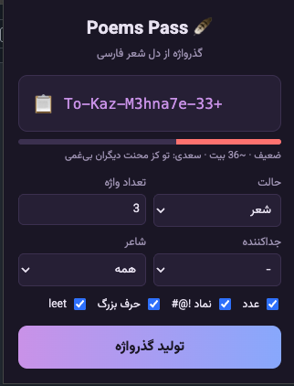

<div align="center">

# 🪶 Poems Pass Generator

### تولید گذرواژه‌ی امن و به‌یادماندنی از دل **شعر و ضرب‌المثل فارسی**
##### یک جایگزین شاعرانه برای `pwgen` — هم **CLI** هم **اکستنشن مرورگر**

[](https://github.com/graygroup/poems-pass-generator/actions/workflows/ci.yml)
[](LICENSE)
[](https://nodejs.org)
[](package.json)
[](#-بدون-نیاز-به-اینترنت)
[](CONTRIBUTING.md)

<br/>

```
gofta-ghame-to-daram-72#      benmay-rokh-ke-bagh-91%
To-Kaz-Mehnate-Digaran-33+    saharkhiz-bash-ta-kamrava-44!
```



<sub>⭐ اگر دوستش داشتی یک ستاره بده تا بقیه هم پیدایش کنند!</sub>

</div>

---

<div dir="rtl">

## ✨ چرا Poems Pass؟

گذرواژه‌های قوی معمولاً غیرقابل‌حفظ‌اند و گذرواژه‌های قابل‌حفظ معمولاً ضعیف. **Poems Pass** این دو را آشتی می‌دهد:
به‌جای واژه‌های تصادفیِ بی‌معنی، از **ریتم شعر فارسی** گذرواژه می‌سازد که هم قوی است و هم در ذهن می‌ماند.

```
gofta-ghame-to-daram-72#
└──────┬──────┘ └┬┘ └┬┘
  شعر حافظ      عدد  نماد
```

## 🎁 ویژگی‌ها

- 📜 **دیتابیس شعر و ضرب‌المثل فارسی** — حافظ، سعدی، مولانا، خیام، فردوسی، سهراب، فروغ، شاملو و…
- 🎲 **سه حالت تولید**: `poem` (شعر) · `proverb` (ضرب‌المثل) · `abstract` (واژه‌های شبه‌فارسیِ ساختگی)
- 🔐 **تصادفی امن (CSPRNG)** بدون بایاس پیمانه‌ای — در Node و مرورگر
- 🎚️ **قابل تنظیم**: تعداد واژه، جداکننده، حرف بزرگ، leet-speak، عدد و نماد خاص `!@#`
- 📊 **برآورد قدرت/آنتروپی** زنده
- 🧩 **CLI + اکستنشن** از یک هسته‌ی مشترک
- 📦 **بدون هیچ وابستگی خارجی** (zero-dependency)
- 🌐 **۱۰۰٪ آفلاین** — هیچ داده‌ای از دستگاه تو خارج نمی‌شود

## 🌐 بدون نیاز به اینترنت

**هیچ وابستگی‌ای به اینترنت ندارد.** کل دیتابیس و موتور تولید روی دستگاه تو اجرا می‌شود؛
نه درخواست شبکه‌ای، نه ردیابی، نه ارسال گذرواژه به هیچ سروری. مناسب برای محیط‌های ایزوله و آفلاین (air-gapped).

---

## ⚡ نصب سریع

### 🖥️ نصب CLI

```bash
git clone https://github.com/graygroup/poems-pass-generator.git
cd poems-pass-generator
npm link            # دستور poems-pass را در کل سیستم فعال می‌کند

poems-pass          # 🎉 اولین گذرواژه‌ات
```

> نیازی به `npm install` نیست چون پروژه **هیچ وابستگی‌ای ندارد**. فقط Node.js نسخه ۱۸ به بالا لازم است.
> برای اجرای بدون نصب: `node bin/poems-pass.js`

### 🧩 نصب اکستنشن مرورگر (Chrome / Edge / Brave)

```bash
npm run build:ext   # هسته را داخل extension/ آماده می‌کند
```

سپس:
1. مرورگر را باز کن و به `chrome://extensions` برو
2. **حالت توسعه‌دهنده (Developer mode)** را از گوشه‌ی بالا روشن کن
3. روی **Load unpacked / بارگذاری بسته‌ی باز** بزن
4. پوشه‌ی **`extension`** پروژه را انتخاب کن
5. آیکون 🪶 را در نوار ابزار ببین و گذرواژه بساز!

> برای ساخت فایل قابل‌انتشار: `npm run pack:ext` → فایل `poems-pass-extension.zip` ساخته می‌شود.

---

## 📖 استفاده‌ی CLI

```bash
poems-pass                                  # یک گذرواژه از شعری تصادفی
poems-pass -n 5 -w 4 -v                      # ۵ گذرواژه، هرکدام ۴ واژه، با جزئیات
poems-pass --poet حافظ                       # فقط از اشعار حافظ
poems-pass -m proverb --no-symbols           # از ضرب‌المثل، بدون نماد
poems-pass -m abstract -w 3 -C -L            # واژه‌های انتزاعی + حرف بزرگ + leet
poems-pass --poets                           # فهرست شاعران
poems-pass --stats                           # آمار دیتابیس
```

### گزینه‌ها

| گزینه | کوتاه | توضیح |
|------|:-----:|------|
| `--count <n>` | `-n` | تعداد گذرواژه‌ها |
| `--words <n>` | `-w` | تعداد واژه در هر گذرواژه |
| `--mode <m>` | `-m` | `poem` \| `proverb` \| `abstract` |
| `--poet <نام>` | | فیلتر شاعر |
| `--sep <c>` | `-s` | جداکننده |
| `--capitalize` | `-C` | حرف اول واژه‌ها بزرگ |
| `--leet` | `-L` | جایگزینی leet (`a→@`, `e→3`, …) |
| `--no-numbers` | | بدون عدد |
| `--no-symbols` | | بدون نماد خاص |
| `--verbose` | `-v` | نمایش منبع و قدرت |

## 🧰 استفاده به‌عنوان کتابخانه

```js
import { generate } from 'poems-pass-generator';

const { password, meta } = generate({ mode: 'poem', words: 3, poet: 'مولانا' });
console.log(password, meta.strength, meta.entropyBits);
```

---

## 🗺️ مرحله‌ی بعدی (Roadmap)

تمرکز بعدی روی **بزرگ‌کردن دیتابیس** و **آسان‌کردن افزودن شعر** است:
- رساندن دیتابیس به ۵۰۰+ بیت و ۲۰۰+ ضرب‌المثل
- اسکریپت ایمپورت از فایل متنی و از [گنجور](https://github.com/ganjoor) (آفلاین)
- بسته‌های دیتابیس افزونه‌ای و ابزار افزودن تعاملی

فهرست کامل: [ROADMAP.md](ROADMAP.md) — مشارکت خوش‌آمد است! 🤝

## 🤝 مشارکت

ساده‌ترین کمک، **افزودن شعر** به [`data/poems.json`](data/poems.json) است. راهنما: [CONTRIBUTING.md](CONTRIBUTING.md)

## 🏗️ ساختار پروژه

```
poems-pass-generator/
├── data/poems.json        # دیتابیس شعر، ضرب‌المثل و هجاها
├── src/core/              # هسته‌ی مشترک (CLI + اکستنشن)
├── src/cli/               # رابط خط فرمان
├── bin/poems-pass.js      # نقطه‌ی اجرای CLI
├── extension/             # اکستنشن Manifest V3
├── scripts/               # build، بسته‌بندی و ساخت آیکون
├── .github/workflows/     # CI/CD
└── test/run.js            # تست‌ها
```

## 🔖 موضوعات (GitHub Topics)

`password-generator` · `passphrase` · `persian` · `farsi` · `poetry` · `persian-poetry` · `pwgen` · `diceware` · `cli` · `chrome-extension` · `browser-extension` · `security` · `nodejs` · `zero-dependency` · `offline`

## 📜 مجوز

[MIT](LICENSE) © graygroup

</div>
